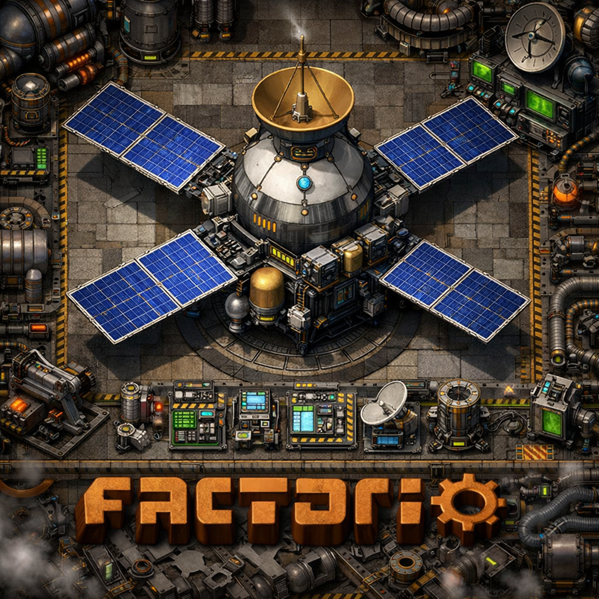

# Give My Satellite Back

A Factorio mod that re-enables the satellite item and recipe in the Space Age DLC.

## Why?

Space Age removes the satellite item and recipe entirely. This mod brings them back so you can use the satellite as a **signal in blueprints and circuit networks**.

The satellite works exactly as it did in vanilla Factorio — same recipe, same ingredients, same technology unlock.

## Recipe

Unlocked by researching **Rocket Silo**:

| Ingredient | Amount |
|---|---|
| Low Density Structure | 100 |
| Solar Panel | 100 |
| Accumulator | 100 |
| Radar | 5 |
| Processing Unit | 100 |
| Rocket Fuel | 50 |

## Installation

1. Download the latest `give-my-satellite-back_x.x.x.zip` from [Releases](https://github.com/GoktugOzturk/give-my-satellite-back/releases)
2. Place the zip file in your Factorio mods folder:
   - **Windows:** `%APPDATA%\Factorio\mods\`
   - **macOS:** `~/Library/Application Support/factorio/mods/`
   - **Linux:** `~/.factorio/mods/`
3. Enable the mod in-game

## Requirements

- Factorio >= 2.0
- Space Age DLC

## License

[MIT](LICENSE)
